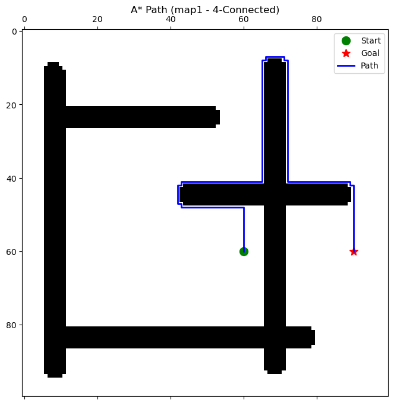

# A* (A-Star) Path Planning Protocol

## Overview
This repository implements an optimal grid-based **A* (A-Star)** path-planning algorithm. Written entirely in Python, the project extracts optimal spatial trajectories by evaluating the formal $f(n) = g(n) + h(n)$ cost function over mathematically rigorous heuristics (Euclidean, Manhattan, Chebyshev). It provides an in-depth comparative analysis tracking computational path-cost variances when shifting a robot's kinematic capabilities between 4-connected (cardinal) and 8-connected (omnidirectional) environments.

## Algorithms Implemented

The implementation is modularized sequentially in the `src/` directory:

1. **Admissible Heuristics Engine:** Computes optimistic remaining costs ($h(n)$) utilized to greedily guide the node search bounding box toward the goal.
2. **Priority Queue Expansion:** Manages the iterative discovery set strictly expanding coordinates possessing the smallest total expected cost.
3. **Graph Traversal Constraints:** Integrates bounds-checking and obstacle collision avoidance dynamically.
4. **Trajectory Reassembly:** Recursively walks the optimum mathematical parent pointers back to the origin.

## Experimental Evaluation

The motion planning algorithms are tested on four strictly separated 2D occupancy grid maps (`map0` - `map3`).

### Performance Testing Scope
* **Connectivity Comparison:** Evaluating quantitative path costs and resulting structural smoothing when migrating from 4-connectivity to 8-connectivity.
* **Algorithmic Completeness:** Observing the deterministic failure states correctly reported when target environments are physically cordoned off by obstacle boundaries.

<p align="center">
  
  
</p>

## Key Insights

* **Connectivity massively influences cost:** Expanding evaluating vectors to include diagonal (8-connected) steps drastically cuts total path costs by allowing the algorithm to slice naturally across open areas, dropping overall trajectory lengths natively by roughly ~20%.
* **A* Guarantees Optimality:** By ensuring the Euclidean estimation heuristic never overestimates the true remaining distance ($h(n) \leq h^*(n)$), the first collision with the final goal configuration mathematically proves it represents the theoretical absolute shortest path possible.

## How to Run

1. Clone the repository and install requirements:
```bash
pip install -r requirements.txt
```

2. Run the main evaluation pipeline:
```bash
python src/main.py
```

This will run all configuration tests across `map0-map3`, output performance logs locally to `results/performance_summary.txt`, and generate comparative visualizations explicitly in `report/result_images/`.

Alternatively, use the provided Jupyter Notebook located in `notebooks/` for interactive analysis.

## Dependencies

- `numpy`
- `matplotlib`
- `Pillow`
