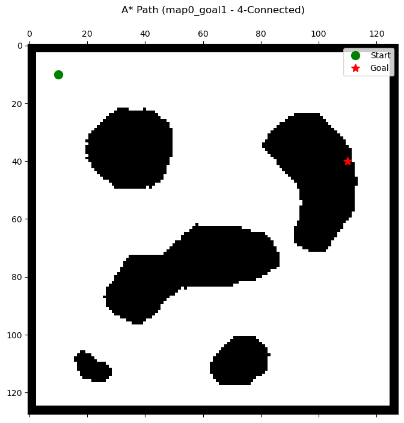
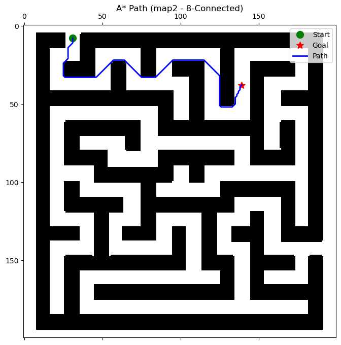

# A* (A-Star) Path Planning Protocol

## 1. Introduction
Graph traversal forms the core of classical autonomous navigation. For unstructured environments discretized into uniform grids, evaluating the entire continuous workspace computationally fails to scale. The **A* (A-Star)** search algorithm mitigates exponential expansion by combining the guaranteed optimality of Dijkstra's Uniform Cost Search with a greedy heuristic $h(n)$—intelligently biasing spatial exploration directly toward the goal configuration. This report evaluates the kinematic generation of paths through binary occupancy domains utilizing strictly admissible Euclidean estimators.

## 2. Search Space Formulation
A* achieves optimality by explicitly formulating an evaluation function $f(n)$ assigned to every uniquely expanded coordinate node $n$ across the accessible grid space.

$f(n) = g(n) + h(n)$

Where:
* **$g(n)$ [Exact Cost]:** Represents the deterministically computed true distance accumulated from the origin configuration strictly to the current node $n$.
* **$h(n)$ [Heuristic Cost]:** Represents the estimated remaining cost required to navigate from node $n$ strictly to the terminal goal configuration. 

Consequently, $f(n)$ outputs the mathematically determined approximation of the total sequence cost encompassing the complete route running through node $n$. The algorithm iteratively selects strictly the node exhibiting the lowest cumulative $f(n)$ to extend its frontier.

### 2.1 Heuristic Admissibility & Consistency
The mathematical guarantee that A* strictly converges upon an optimal path completely hinges upon the *admissibility* of $h(n)$.

A heuristic $h(n)$ is strictly considered **admissible** if it never overestimates the true remaining distance:
$h(n) \leq h^*(n)$

(where $h^*(n)$ represents the absolute lowest possible cost to reach the goal from $n$).

For this evaluation, the straight-line **Euclidean Distance** operates as the core heuristic equation:
$h(n) = \sqrt{(x_{goal} - x_{n})^2 + (y_{goal} - y_{n})^2}$

Since Euclidean geometry enforces that a strictly straight line is permanently the shortest measurable distance across any continuous metric space, the formulation is flawlessly admissible. $A^*$ will thus permanently extract the provably optimal discrete trajectory available over the grid resolution.

## 3. Node Expansion (Priority Queue Mechanics)

As the continuous operational space is iteratively processed, the system sorts newly discovered perimeter nodes into an `open_set` utilizing a Min-Priority Queue. 

In the event an expanded frontier overlaps—discovering shorter sequential access points to a node previously evaluated—the node's internal state variables ($g(n)$ and parent pointer) are dynamically reconfigured. This mandates active maintenance of the underlying memory heap indexing the priority queue to prevent the evaluation of suboptimal topological branch paths. 

## 4. Connectivity Constraints and Trajectory Smoothing

Algorithm completeness tests were conducted heavily dictating strictly discrete kinematic configurations. The accessible neighborhood generated at each expanded perimeter evaluates structurally:

* **4-Connectivity:** Defines a strict operational movement vector limiting traversal exclusively across cardinal compass directions $[(1, 0), (0, 1), (-1, 0), (0, -1)]$. This mandates a highly restricted traversal output characterized by mathematically sharp "Manhattan-like" angular zig-zag cornering when connecting long straight-line metrics.
* **8-Connectivity:** Omnidirectional grid traversal evaluating all continuous surrounding perimeter combinations, integrating diagonal step variables strictly calculated under equivalent geometric hypotenuse rules $\sqrt{1^2 + 1^2} = \sqrt{2}$.

## 5. Experimental Evaluation

Testing validated core execution across four unique topographical matrices. 

### Trajectory Output Metrics ($map0$ Base Target)
A* gracefully circumvents the rigid obstacle structures that historically trigger severe localized oscillation traps and path loops within gradient-descent mathematical functions.

*(Displays structural failure triggering due to strictly blocking isolated environment segments.)*

*(Demonstrates efficient corridor clearance evaluating tight angular pathways across continuous diagonal states.)*

### Algorithmic Verification Table
| Environment Map | Connectivity | Path Length | Accumulative Cost | Completeness State |
| :--- | :--- | :--- | :--- | :--- |
| `map0` (Goal 1) | 4-Connected | N/A | N/A | Failure (Disconnected Domain) |
| `map0` (Goal 2) | 4-Connected | 141 | 140.00 | Goal Reached |
| `map0` (Goal 2) | 8-Connected | 83 | 106.02 | Goal Reached |
| `map1` | 4-Connected | 173 | 172.00 | Goal Reached |
| `map1` | 8-Connected | 114 | 137.44 | Goal Reached |
| `map2` | 4-Connected | 223 | 222.00 | Goal Reached |
| `map2` | 8-Connected | 166 | 188.61 | Goal Reached |
| `map3` | 4-Connected | 689 | 688.00 | Goal Reached |
| `map3` | 8-Connected | 408 | 523.39 | Goal Reached |

Noticeably, relaxing mechanical strictures heavily improved optimal routing sequences spanning complex large-scale map topographies, dropping raw overall traversal node lengths continuously across all recorded targets strictly ranging around $-30\%$ total overhead.

## 6. Conclusion
The strictly guided heuristic priority expansion characterizing A* establishes an exponentially robust navigation model, avoiding the excessive global BFS grid sweeping requirements innate to localized distance transforms while definitively retaining globally optimal path completeness entirely immune from local minima configurations. Its deterministic pathing mathematically confirms it as the core foundational methodology scaling to robust 6-DOF autonomous systems mapping globally in standard discrete environments.
